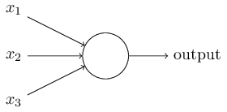
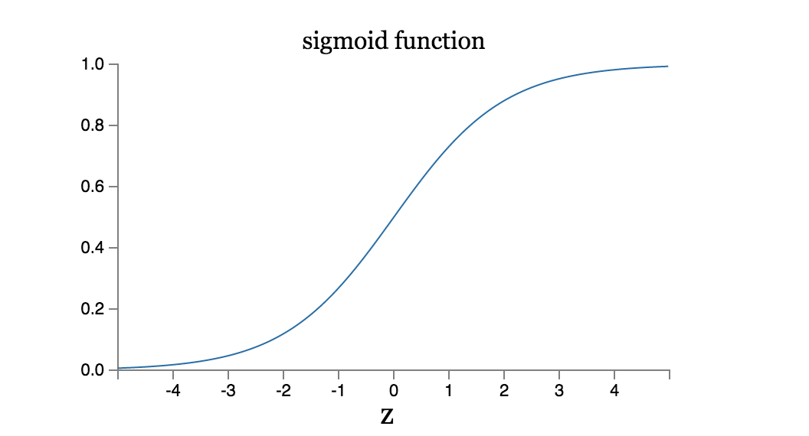

# Field Guide to Neural Networks
### By Patrick D. Smith.

This field guide was developed for the Data Science Immersive Class at General Assembly, Washington DC. 

| CHAPTER  | DESCRIPTION  |
|---|---|
| [Introduction](#introduction) | Intro to ANNs |
| [History of Artificial Neural Networks](#history) | A brief history of the development of ANNs |
| [Elements of Neural Networks](#elements) | What makes up a neural network? |
| [Structure of Artificial Neural Networks](#structure) | Putting the elements together |
| [Types of Networks](#types) | Different types of networks and their implementation |
| [Conclusion](#conclusion) | Conclusion |


<a name="introduction"></a>
# Introduction 

We live in an age of machine learning; as one of the most important and growing areas of study in the modern technology age, machine learning and it's applications have the potential to penetrate every aspect of our lives. From text and voice recognition to self driving cars - it's already shaping our future lives and enviroment. Within machine learning, one of the biggest areas of research and development is with artificial neural networks. 


Neural Networks *learn* by *training* on observational datasets. 

There's no one way to define what a neural network is - however we can generally classify ANN models as having:

- Adaptive weights that respond to positive or negative results. This is essentially the *learning* aspect of ANNs. 
- The ability to compute functions of a non-linear manner. 

ANNs are non-linear, distributed, parallel and adaptive. 

When constructing ANNs, it's important to keep in mind that when we first construct our ANN, we should expect it to be not so sure of it's predictions in the beginning. Once we continually feed it training data, the network should then become **more** confident as it learns the correct classifications. 

<a name="history"></a>
# A Brief History of ANNs and Their Development

In 1943, Warren McCulloch and Walter Pitts drew out the first conceptual network on the basic of the brain's frontal cortex. Whereas the basis for ANNs was originally derived from the structure of biological neural networks (see *perceptrons*), more networks are based or firmer signal processing and statistical models. 

## Arriving at modern day neural networks

### Perceptrons 

Perceptrons are the most basic artificial neurons that make Neural Networks work. Developed in the 1950s by Frank Rosenblatt, these artificial neurons are less common today as they are typically used to make simplistic decisions. 

A perceptron takes several inputs and determines one singular output. To compute output, perceptrons use *weights*, which are simply numbers that represent how import each input signal is to the aggregated final output. The pre-output of the perception is then determined by the summation of these various weighted inputs. Once we have a weight, it is measured against a *threshold value* which will determine the final binary output, say *0* or *1*. 

Say we have two possible binary outputs, 1 and 2, and we need to classify our inputs as such. The perceptron will take *X* inputs and weight and return a single decision.

Below, you can see an implementation of the perceptron rule in Python. 

```
class Perceptron(object):

    def __init__(self, eta=0.01, epochs=50):
        self.eta = eta
        self.epochs = epochs

    def train(self, X, y):

        self.w_ = np.zeros(1 + X.shape[1])
        self.errors_ = []

        for _ in range(self.epochs):
            errors = 0
            for xi, target in zip(X, y):
                update = self.eta * (target - self.predict(xi))
                self.w_[1:] +=  update * xi
                self.w_[0] +=  update
                errors += int(update != 0.0)
            self.errors_.append(errors)
        return self

    def net_input(self, X):
        return np.dot(X, self.w_[1:]) + self.w_[0]

    def predict(self, X):
        return np.where(self.net_input(X) >= 0.0, 1, -1)

```

The problem with perceptrons is that they work more or less perfectly if you data can be represented on a linear plane. However if your data exists in some other form of feature space, however, it is necessary to use a more advanced form of artificial neuron. 

### Adaptive Linear Neurons - AKA ADALINE

A few years after the development of the perceptron, a scientist by the name of Bernard Widrow developed on the perceptron concept and created the adaptive linear neuron. The funamental difference between the functions exists in the manner in which each derive their weights - whereas the perceptron uses a *unit step function*, the ADALINE utilizes a **linear activation function*

<a name="elements"></a>
# Elements of Neural Networks

## Artificial Neurons


### Sigmoid Neurons 

By utilizing Sigmoid Neurons, our 

Sigmoid Neurons allow for the small changes in weight that adjust to small changes in output that make learning possible. 



Just like it's predecessor the perceptron, sigmoid neurons have multiple inputs. However, as opposed to have a binary input of say, 0 or 1, the inputs of a sigmoid neuron can take on any value within the range of 0 and 1. Similar to a perceptron, the sigmoid neuron has weights for each input and an overall bias weight. 

The output of a sigmoid neuron is represented by the *sigmoid function*. You're probably familiar with the sigmoid curve: 



## Softmax Function

The softmax function can be thought of as an additional layer in the ANN. 

When we create an ANN, we fundamentally want to find the values of the weights and biases that are good at arriving at our target predictions. Essentially, we want to train our network so that the probability of the correct class is close to one, while the probability of every incorrect class if close to zero. To way to convert these scores into probabilities is to use a softmax function. 


## Gradient Descent

Gradient descent is an optimization algorithm that is perhaps the most commonly used optimization algorithm in ANN's. 

### 3. 1 The Cost Function 

The **cost function** or **loss function** allows us to quantify how well our network is approximating it's output. If we call our network weights *W*, this function is directly measuring the quality of weights *W*. We ultimately want to discover the *W* the minimizes the cost function. 


In this function *C* represents the **mean squared error**

**Computing the Gradient**

```python
def eval_numerical_gradient(f, x):
  """ 
  a naive implementation of numerical gradient of f at x 
  - f should be a function that takes a single argument
  - x is the point (numpy array) to evaluate the gradient at
  """ 

  fx = f(x) # evaluate function value at original point
  grad = np.zeros(x.shape)
  h = 0.00001

  # iterate over all indexes in x
  it = np.nditer(x, flags=['multi_index'], op_flags=['readwrite'])
  while not it.finished:

    # evaluate function at x+h
    ix = it.multi_index
    old_value = x[ix]
    x[ix] = old_value + h # increment by h
    fxh = f(x) # evalute f(x + h)
    x[ix] = old_value # restore to previous value (very important!)

    # compute the partial derivative
    grad[ix] = (fxh - fx) / h # the slope
    it.iternext() # step to next dimension

  return grad


```


### The Backpropogation Algorithm

### The Cross-Entropy Cost Function

<a name="structure"></a>
# The Structure of Artificial Neural Networks


<a name="tuning"></a>
# Tuning Neural Networks

## Regularization Methods

## How to Choose Parameters for Neural Networks


<a name="types"></a>
# Section IV: Types of Artificial Neural Networks

There are numerous types of neural networks. In fact, it wouldn't be too far off to say that not one network works exactly the same. 

There are two primary forms of ANNs: **Convolutional Neural Networks** and **Recurrent Neural Networks**.

---
## Convolutional Neural Networks

Convolutional networks can be thought of as a larger, more biologically inspired varient of a multi-layer perceptron network. 

These networks are large networks that essentially work off of identical copies of the same neuron. With this structure, we can increase the computational power of our network with more neurons while keeping the number of parameters for the entire network fairly low. If we think of a single neuron like a function in programming, the ability to replicate neurons across the network for a variety of uses increases our computational time while decreasing our errors. 


These network are based on three principles:

- Local receptive fields 
- Shared weights
- Pooling

Covolutional networks take into account the spatial structure of data; as such they are frequently used for image recognition.  

With convolutional networks - the structure represents more of a 

#### Uses of Convolutional Networks

Convolutional neural networks are useful when: 

- Your data's structure is spatial or temporal; IE your features depend solely on the neighborhood of input data
- These same local features can be in every spatial or temporal position

Practical Problems: 

- Image Recognition (Computer Vision) 
- Voice Recognition


---
## Recurrent Neural Networks

Think about how a human thinks - do you think a new thought every moment when trying to read or comprehend a situation? Quite the contrary; we comprehend what is going on in the moment based on the context of everything that has come before. 

Recurrent neural networks have backwards feedback loops.

--
#### LSTM's
Long Short Term Memory, or LSTM's are a special form of a recurrent neural network which solve the problem of long-term dependencies that arise with stanfard RNN's. 


---
## Deep Neural Networks

We've learned about Shallow Neural Networks, but what about Deep Neural Networks or *Deep Learning*? 


---
## Deep Convolutional Networks


---
## Deep Belief Networks

Deep belief nets were popular applications of deep learning for the later half of the 200s.

A Deep Belief Network is a form of a *generative model*. In a generative model, feature neurons can be run backwards, which means that they can generate input values for the network. Going back to our handwriting example, a Deep Belief Network can not only recognize handwritten words, it can generate them. In an essence, this type of networks can *read* and *write* just as a human could. 

DBN's can be used for unsupervised learning. 

While DBN's are the greatest in terms of long term scientific potential, they have fallen "out of fashion" at the moment. 

## Generative Models

## Boltzmann Machines

## Memory Networks

**Neural Turing Machines**

# Applications of Neural Networks

Deep Neural Networks can be trained to do natural langauge processing, machine translation, and the scientific study of music - known as music informatics

Deep Neural Networks have even been used to effectively play video games by utilizing a convolutional neural network with reinforcement learning. 

## Where are Neural Networks Going? 

### Intention Driven User Interfaces

A long term project of DARPA, Intention Driven User Interfaces will learn the structure of inputs to undetstand what is actually meant by a sentence, so that meaning can be derived from an input. 

#### Siri 

#### Wolfram Alpha

#### IBM Watson 

#### Facebook Deep Text

## Practice with Neural Networks
